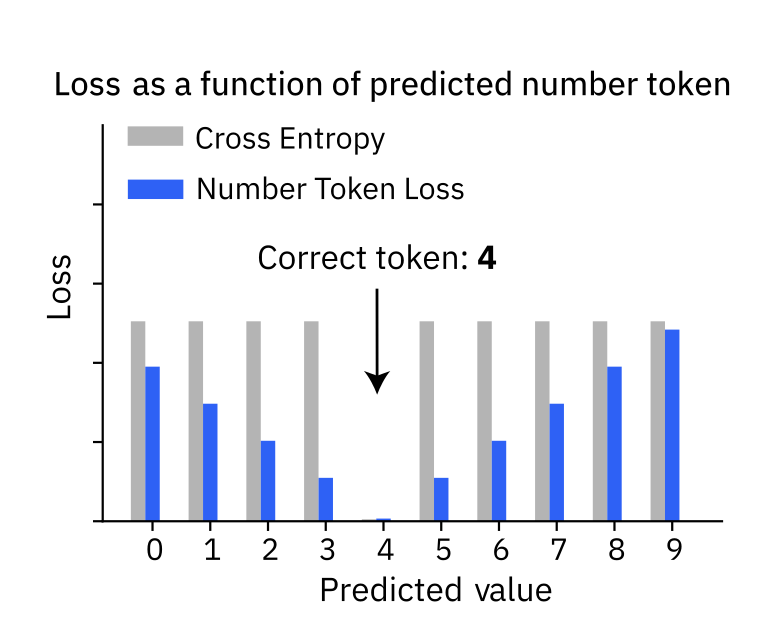

<div align="center">


# Regress, Don't Guess – A Regression-like Loss on Number Tokens for Language Models

[](https://arxiv.org/abs/2411.02083)
[](https://tum-ai.github.io/number-token-loss/)
[](https://huggingface.co/spaces/jannisborn/NumberTokenLoss)
[](scripts/loss_integration.ipynb)
[](LICENSE)

*Introducing "Number Token Loss" (NTL) for language models to improve 
numerical reasoning by using regression-based loss functions on number tokens.
Achieves better performance on math tasks without computational overhead 🚀*


</div>

---

## 📖 Overview

**Number Token Loss (NTL)** introduces a novel approach to enhance language models' numerical reasoning capabilities. Unlike traditional cross-entropy loss that treats all incorrect predictions equally, NTL incorporates the numerical proximity of tokens, providing regression-like behavior at the token level.


## 🎯 Why do we need the Number Token Loss (NTL)?
<p class="text-justify">
  Cross Entropy is <strong>nominal-scale</strong> and thus assigns equal loss to all incorrect predictions. This makes sense for normal tokens but not for number tokens:
</p>

<div align="center">
  <strong>
    With a ground truth token <code>4</code>, predicting <code>3</code> or <code>9</code> should not give equal loss 🤔😱<br>NTL fixes this! 🚀💪
  </strong>
</div>

<p class="text-justify">
  For all number tokens, NTL increases with distance from ground truth just like a regression loss.
  But it doesn't need an extra head, it allows computing a regression-like loss directly on a token head.
  We propose two schemes:
  <br>
  <strong>NTL-WAS</strong> – Wasserstein-1 distance between predicted and one-hot number distributions (see plot above).<br>
  <strong>NTL-MSE</strong> – Dot-product expectation of numeric value with squared error (most intuitive but has some undesired local minima)
</p>



## 🔑 Key Features

- 🎯 **Model-Agnostic**:  NTL is just a loss &rightarrow; applicable to any LM (e.g., Transformer, Mamba) in any architecture (encoder-decoder, decoder-only).
- 🔌 **Plug-and-Play**: NTL requires only a mapping from tokens to numeric values and works with digit-level and multi-digit tokenizations.
- ⚡ **No computational overhead**: NTL adds only ~1% compute time to <emph>loss calculation</emph> which is negligible over a full training step.
- 📈 **Consistently improves performance**: NTL outperforms plain cross entropy across multiple architectures and math benchmarks.
- 🔢 **Performs true regression**: On regression tasks a LM head with NTL matches a dedicated regression head.
- 🚀 **Scales to large models**: Even <a href="https://huggingface.co/ibm-granite/granite-3.2-2b-instruct">Granite 3.2 2B</a> and <a href="https://huggingface.co/google-t5/t5-3b">T5-3B</a> benefit heavily from NTL on math tasks like GSM8K.


## 🚀 Quick Links

- 📄 **Paper**: [Regress, Don't Guess – A Regression-like Loss on Number Tokens for Language Models](https://arxiv.org/abs/2411.02083)
- 🌐 **Project Page**: [https://tum-ai.github.io/number-token-loss/](https://tum-ai.github.io/number-token-loss/)
- 🎮 **Interactive Demo**: [https://huggingface.co/spaces/jannisborn/NumberTokenLoss](https://huggingface.co/spaces/jannisborn/NumberTokenLoss)
- 📋 **NeurIPS 2024 MathAI Workshop Poster**: [View Poster](https://github.com/tum-ai/number-token-loss/blob/main/resources/neurips_mathai_poster.pdf)
- 💻 **Lightweight Integration Example**: [loss_integration.ipynb](scripts/loss_integration.ipynb) - Easy integration into your own models

## 🛠️ Installation

### Prerequisites
- Python 3.9 or higher
- CUDA-compatible GPU (recommended)

### Setup Instructions

1. **Clone the repository**
   ```bash
   git clone https://github.com/tum-ai/number-token-loss.git
   cd number-token-loss
   ```

2. **Create and activate environment**
   ```bash
   conda create -n ntl python=3.10
   conda activate ntl
   ```

3. **Install dependencies**
   ```bash
   pip install -r requirements.txt
   pip install -e .
   ```

4. **Configure Weights & Biases**
   ```bash
   wandb login
   export WANDB_ENTITY='<your_entity>'
   export WANDB_PROJECT='<your_project_name>'
   ```

## 🏃‍♂️ Quick Start

### Easy Integration into Your Model

For a **minimal working example** of how to integrate NTL into your existing Hugging Face model, check out our [lightweight integration notebook](scripts/loss_integration.ipynb). It demonstrates:

- How to add NTL to any decoder-only language model (e.g., LLaMA, GPT)
- Custom trainer implementation with CE+NTL loss
- Complete working example with TinyLLaMA

### Full Training Pipeline

The main training script uses Hydra for configuration management:

```bash
python src/ntl/run_language_modeling.py \
    dataset_args=mathematics_dataset \
    model_args=vanilla_t5_ntl \
    training_args=train
```

### Configuration Options

- **Datasets**: `gsm8k`, `mathematics_dataset`, `arithmetic`, `rjokes`, `multirc`
- **Models**: `vanilla_t5`, `vanilla_t5_ntl`, `rt`, `rt_ntl`, `xval`
- **Training**: `train`, `eval`

### Custom Configuration

Override default parameters via command line:
```bash
python src/ntl/run_language_modeling.py \
    model_args=vanilla_t5_ntl \
    training_args=train \
    training_args.per_device_train_batch_size=8 \
    model_args.number_token_loss_weight=0.3
```

## 📊 Experimental Results

<details>
<summary>Download the used datasets</summary>

- Mathematics Dataset from DeepMind:
  1. Get the data from https://console.cloud.google.com/storage/browser/mathematics-dataset;tab=objects?pli=1&prefix=&forceOnObjectsSortingFiltering=false
  2. Execute [create_data_splits.py](data%2Fmathematics_dataset-v1.0%2Fcreate_data_splits.py)
  3. Put the .txt files under data/mathematics_dataset-v1.0/
- Ablation Studies on part of the Mathematics Dataset
  1. Execute [arith_create_splits.py](data%2Fmathematics_dataset-v1.0%2Farith_create_splits.py)
  2. The resulting files (arithmetic_train.txt, arithmetic_val.txt, arithmetic_test_interpolate.txt, arithmetic_test_extrapolate.txt) should be under data/mathematics_dataset-v1.0/
- NTL on a regression task (rjokes dataset)
  1. Download data from https://github.com/orionw/rJokesData
  2. Put train.tsv, dev.tsv and test.tsv under data/rjokes-dataset/data
  3. Execute [generate_dataset.py](data%2Frjokes-dataset%2Fgenerate_dataset.py)
- MultiRC dataset
  1. Download the MultiRC dataset from https://dl.fbaipublicfiles.com/glue/superglue/data/v2/MultiRC.zip
  2. Put the train.jsonl, val.jsonl and test.jsonl files under data/multirc/data
  3. Execute [generate_dataset.py](data%2Frjokes-dataset%2Fgenerate_dataset.py)
  4. The generated files should be under data/multirc/data/preprocessed
</details>

### Mathematics Dataset

| Model | Configuration | Command |
|-------|--------------|---------|
| **T5 Baseline** | Standard Cross-Entropy | `python src/ntl/run_language_modeling.py run_specific_config@_global_=mathematics_dataset_run model_args=vanilla_t5 dataset_args=mathematics_dataset` |
| **T5 + NTL-MSE** | MSE-based NTL | `python src/ntl/run_language_modeling.py run_specific_config@_global_=mathematics_dataset_run model_args=vanilla_t5_ntl dataset_args=mathematics_dataset` |
| **T5 + NTL-WAS** | Wasserstein-based NTL | `python src/ntl/run_language_modeling.py run_specific_config@_global_=mathematics_dataset_run model_args=vanilla_t5_ntl model_args.number_token_loss_with_wasserstein=true dataset_args=mathematics_dataset` |

### Ablation Studies

Comprehensive ablation studies on arithmetic subsets:

<details>
<summary>View Ablation Commands</summary>

**NTL-MSE with Different Weights:**
```bash
# λ = 0.3
python src/ntl/run_language_modeling.py dataset_args=arithmetic model_args=vanilla_t5_ntl model_args.number_token_loss_with_wasserstein=false model_args.number_token_loss_weight=0.3 training_args.special_name=NTL-MSE_Lambda0.3

# λ = 0.8  
python src/ntl/run_language_modeling.py dataset_args=arithmetic model_args=vanilla_t5_ntl model_args.number_token_loss_with_wasserstein=false model_args.number_token_loss_weight=0.8 training_args.special_name=NTL-MSE_Lambda0.8

# λ = 2.0
python src/ntl/run_language_modeling.py dataset_args=arithmetic model_args=vanilla_t5_ntl model_args.number_token_loss_with_wasserstein=false model_args.number_token_loss_weight=2.0 training_args.special_name=NTL-MSE_Lambda2.0
```

**Alternative Loss Functions:**
```bash
# NTL-MAE
python src/ntl/run_language_modeling.py dataset_args=arithmetic model_args=vanilla_t5_ntl +model_args.number_token_loss_function=mae training_args.special_name=NTL-MAE_Lambda0.3

# NTL-Huber
python src/ntl/run_language_modeling.py dataset_args=arithmetic model_args=vanilla_t5_ntl +model_args.number_token_loss_function=huber training_args.special_name=NTL-Huber_Lambda0.3
```

</details>

### Large-Scale Evaluation (GSM8K)

Scale NTL to 3B parameter models:

```bash
# T5-3B Baseline
python src/ntl/run_language_modeling.py run_specific_config@_global_=gsm8k_runs model_args=vanilla_t5 dataset_args=gsm8k

# T5-3B + NTL-WAS
python src/ntl/run_language_modeling.py run_specific_config@_global_=gsm8k_runs model_args=vanilla_t5_ntl dataset_args=gsm8k model_args.number_token_loss_weight=0.3
```

## 🧪 Advanced Usage

### Debugging Mode
```bash
python src/ntl/run_language_modeling.py \
    model_args=vanilla_t5 \
    training_args=train \
    run_specific_config@_global_=debug_config
```


### Model Evaluation
```bash
python src/ntl/run_language_modeling.py \
    model_args=vanilla_t5_ntl \
    training_args=eval \
    model_args.model_name_or_path=<path_to_checkpoint>
```

## 📝 Citation

If you find this work useful, please cite our paper:

```bibtex
@inproceedings{zausinger2025regress,
  title   = {Regress, Don't Guess – A Regression-like Loss on Number Tokens for Language Models},
  author  = {Jonas Zausinger and Lars Pennig and Anamarija Kozina and Sean Sdahl
             and Julian Sikora and Adrian Dendorfer and Timofey Kuznetsov
             and Mohamad Hagog and Nina Wiedemann and Kacper Chlodny
             and Vincent Limbach and Anna Ketteler and Thorben Prein
             and Vishwa Mohan Singh and Michael Danziger and Jannis Born},
  booktitle = {Proc. of the 41st International Conference on Machine Learning (ICML)},
  year    = {2025},
  url     = {https://tum-ai.github.io/number-token-loss/}
}
```

## 📄 License

This project is licensed under the MIT License - see the [LICENSE](LICENSE) file for details.

<!-- ## 🙏 Acknowledgments

This work was supported by TUM.ai, Technical University of Munich, and IBM Research Europe. Special thanks to the NeurIPS 2024 MathAI Workshop for featuring our research.
-->
--- 

<div align="center">

**[🌐 Project Website](https://tum-ai.github.io/number-token-loss/) | [📄 Paper](https://arxiv.org/abs/2411.02083) | [🎮 Demo](https://huggingface.co/spaces/jannisborn/NumberTokenLoss) | [💻 Integration Example](scripts/loss_integration.ipynb)**

</div>